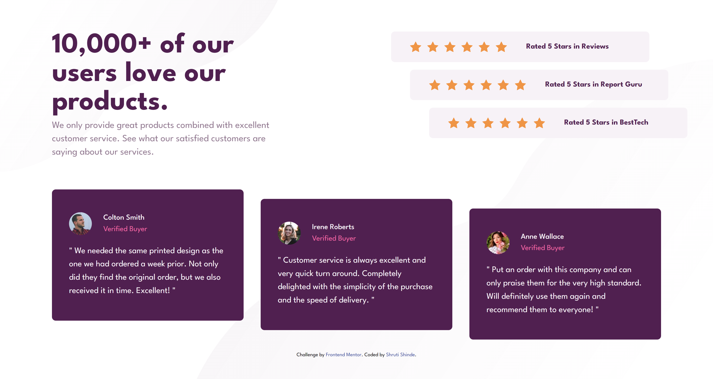

# Frontend Mentor - Social proof section solution

This is a solution to the [Social proof section challenge on Frontend Mentor](https://www.frontendmentor.io/challenges/social-proof-section-6e0qTv_bA). Frontend Mentor challenges help you improve your coding skills by building realistic projects. 

## Table of contents

- [Frontend Mentor - Social proof section solution](#frontend-mentor---social-proof-section-solution)
  - [Table of contents](#table-of-contents)
    - [Screenshot](#screenshot)
    - [Links](#links)
  - [My process](#my-process)
    - [Built with](#built-with)
  - [Author](#author)

### Screenshot

### Links

- Solution URL: [https://github.com/ShrutiShinde418/FrontendMentor3/tree/main/social-proof-section](https://github.com/ShrutiShinde418/FrontendMentor3/tree/main/social-proof-section)
- Live Site URL: [https://social-proof-section-in1dfcsw9-shrutishinde418.vercel.app/](https://social-proof-section-in1dfcsw9-shrutishinde418.vercel.app/)

## My process

### Built with

- Semantic HTML5 markup
- Tailwind CSS

## Author

- Frontend Mentor - [@ShrutiShinde418](https://www.frontendmentor.io/profile/ShrutiShinde418)

