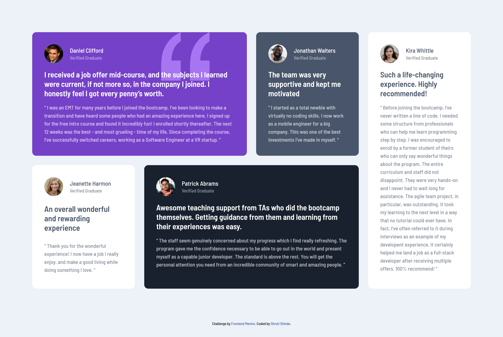

# Frontend Mentor - Testimonials grid section solution

This is a solution to the [Testimonials grid section challenge on Frontend Mentor](https://www.frontendmentor.io/challenges/testimonials-grid-section-Nnw6J7Un7). Frontend Mentor challenges help you improve your coding skills by building realistic projects. 

## Table of contents

- [Frontend Mentor - Testimonials grid section solution](#frontend-mentor---testimonials-grid-section-solution)
  - [Table of contents](#table-of-contents)
  - [Overview](#overview)
    - [The challenge](#the-challenge)
    - [Screenshot](#screenshot)
    - [Links](#links)
  - [My process](#my-process)
    - [Built with](#built-with)
  - [Author](#author)

## Overview

### The challenge

Users should be able to:

- View the optimal layout for the site depending on their device's screen size

### Screenshot

### Links

- Solution URL: [https://github.com/ShrutiShinde418/FrontendMentor3/tree/main/testimonials-grid-section](https://github.com/ShrutiShinde418/FrontendMentor3/tree/main/testimonials-grid-section)
- Live Site URL: [https://frontend-mentor3-2hqzha40p-shrutishinde418.vercel.app/](https://frontend-mentor3-2hqzha40p-shrutishinde418.vercel.app/)

## My process

### Built with

- Tailwind CSS

## Author

- Frontend Mentor - [@ShrutiShinde418](https://www.frontendmentor.io/profile/ShrutiShinde418)
  
